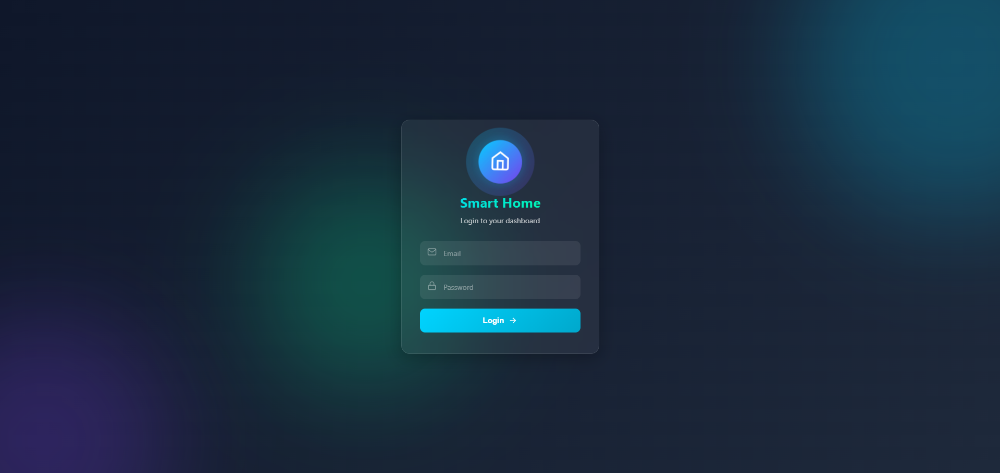
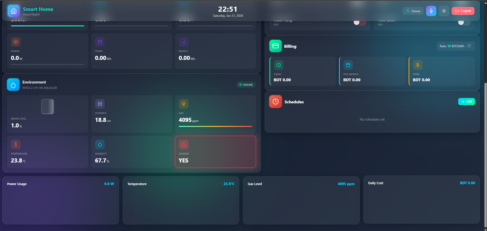

# Smart Home Dashboard

A modern, real-time web dashboard for monitoring and controlling a multi-ESP32 based Smart Home Automation system using Firebase Realtime Database.

This dashboard provides live sensor data visualization, remote device control, automation, alerts, and energy billing information through a clean and responsive UI.

## Live Web Application

https://masudhome.netlify.app

## Demo Login Credentials

For demonstration and evaluation purposes only.

Email: masud.nil74@gmail.com  
Password: 123456

## Related Repository (Code & Implementation)

This dashboard works together with the ESP32 firmware and system implementation available here:

https://github.com/Masud744/IoT-Based-Home-Automation-and-Energy-Monitoring-System

That repository contains:

- ESP32 Arduino source codes
- Hardware implementation details
- Sensor logic
- Firebase database structure
- System architecture

##  Dashboard Preview

> Screenshots of the dashboard UI and system status

###  Login Page

###  Main Dashboard Overview

###  Energy Monitoring Panel

###  Environment Monitoring Panel

## Key Features

- Multi-ESP32 device support
- Real-time Firebase data synchronization
- Energy monitoring and billing visualization
- Environment and safety monitoring
- Remote relay and pump control
- Automation and scheduling
- Visual alerts for gas, water level, and voltage

## System Architecture (High-Level)

ESP32 Devices -> Firebase Realtime Database -> Web Dashboard

Each ESP32 uses a dedicated Firebase node:
devices/esp32_1 (Energy Monitoring)
devices/esp32_2 (Environment Monitoring)

## Tech Stack

Frontend: HTML, CSS, JavaScript  
Cloud Backend: Firebase Realtime Database, Firebase Authentication  
Hardware: ESP32 (multiple devices)  
Charts: Chart.js  
Deployment: Netlify

## Project Structure

smart-home-dashboard/

- index.html
- dashboard.html
- app.js
- style.css
- images/
- README.md

## Deployment

This dashboard is deployed as a **static website** using Netlify.

**Netlify Settings:**
- Build command: *(none)*
- Publish directory: `/`

## Author

**Shahriar Alom Masud**  
B.Sc. Engg. in IoT & Robotics Engineering  
University of Frontier Technology, Bangladesh  
📧 Email: shahriar0002@std.uftb.ac.bd  
🔗 LinkedIn: https://www.linkedin.com/in/shahriar-alom-masud

## License

This project is intended for educational and demonstration purposes.
